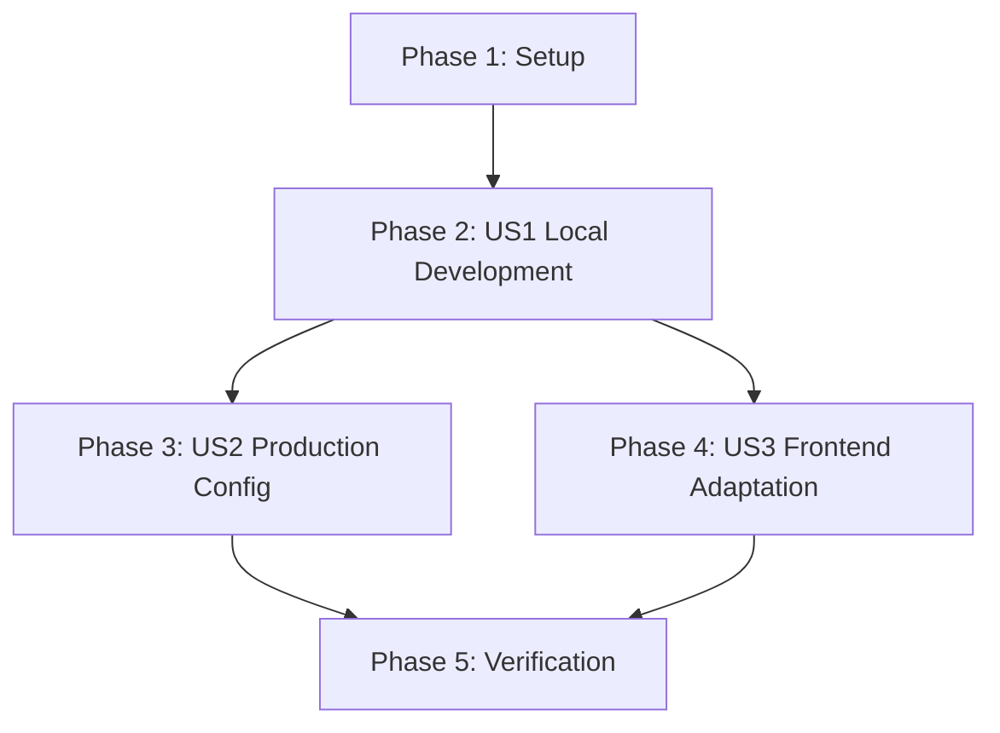

# Implementation Tasks: Environment-Driven CORS and API Configuration

**Feature**: 001-cors-env-config
**Branch**: `001-cors-env-config`
**Date**: 2025-12-12

## Overview

Refactor CORS origins and API URLs to use environment variables, implementing Constitution Principle IX (Zero-Edit Deployment Configuration).

**Total Tasks**: 7
**Parallelizable**: 2
**Estimated Implementation Time**: 30 minutes

## Task Dependencies



### User Story Completion Order

1. **US1** (P1): Local Development - MUST complete first (foundational)
2. **US2** (P2): Production Config - Can start after US1 backend changes
3. **US3** (P3): Frontend Adaptation - Can start after US1 backend changes
4. **Verification**: Final testing after all stories complete

### Parallel Execution Opportunities

**After US1 Backend Task (T002)**:
- T003 [P] [US2] and T004 [P] [US3] can run in parallel (different files)

## Implementation Strategy

**MVP Scope**: US1 (Local Development)
- Delivers: Zero-config local development with environment-driven CORS
- Validates: Core refactoring pattern works before proceeding

**Incremental Delivery**:
1. Phase 2 (US1): Core backend + frontend changes → Verify localhost works
2. Phase 3-4 (US2+US3): Add production config → Verify with env vars
3. Phase 5: Full integration testing

---

## Phase 1: Setup

**Goal**: Verify existing infrastructure and prepare for implementation

### Tasks

- [ ] T001 Verify existing pydantic-settings configuration in backend/app/core/config.py
  - **File**: backend/app/core/config.py
  - **Action**: Read lines 36 and 56-59, confirm `allowed_origins` field and `allowed_origins_list` property exist
  - **Acceptance**: Field exists with default `"http://localhost:3000"`, property splits by comma

---

## Phase 2: User Story 1 (P1) - Local Development Works Without Configuration

**Story Goal**: Developer clones repository and runs `npm start` and `python main.py` without environment configuration. Application works immediately.

**Acceptance Criteria**:
- Fresh clone with no .env file works with localhost
- Backend defaults to localhost:3000 and 127.0.0.1:3000
- Chat widget connects without CORS errors

**Independent Test**:
1. Delete backend/.env (if exists)
2. Start backend: `cd backend && python -m uvicorn main:app --host 0.0.0.0 --port 8000`
3. Verify logs show: `✅ Allowed CORS origins: ['http://localhost:3000', 'http://127.0.0.1:3000']`
4. Start frontend: `npx docusaurus start`
5. Open http://localhost:3000, test chat widget
6. Expected: No CORS errors, chat connects successfully

### Tasks

- [ ] T002 [US1] Refactor backend CORS configuration to use environment-driven origins in backend/main.py
  - **File**: backend/main.py (lines 87-93)
  - **Current**: `allow_origins=["*"]` (hardcoded wildcard)
  - **Changes**:
    1. Add validation logic before CORSMiddleware initialization:
       ```python
       # Validate and log CORS configuration (FR-004, FR-005)
       validated_origins = [
           origin for origin in settings.allowed_origins_list
           if origin.startswith(('http://', 'https://'))
       ]

       if not validated_origins:
           validated_origins = ["http://localhost:3000", "http://127.0.0.1:3000"]

       print(f"✅ Allowed CORS origins: {validated_origins}")
       ```
    2. Replace hardcoded `allow_origins=["*"]` with `allow_origins=validated_origins`
  - **Acceptance**:
    - No hardcoded `["*"]` remains
    - Logs show allowed origins at startup
    - Wildcard origins prevented (FR-003)
    - Protocol validation enforced (FR-004)
    - Localhost fallback works if env var missing

- [ ] T003 [P] [US1] Add environment-aware API URL constant in src/components/ChatWidget/index.js
  - **File**: src/components/ChatWidget/index.js
  - **Changes**:
    1. Add constant after imports (~line 3):
       ```javascript
       // Environment-aware API URL (FR-006, FR-007)
       const API_BASE_URL = process.env.REACT_APP_API_URL || 'http://localhost:8000';
       ```
    2. Replace hardcoded URL in fetch call (line 106):
       ```javascript
       // Before: const response = await fetch('http://localhost:8000/api/chat', {
       const response = await fetch(`${API_BASE_URL}/api/chat`, {
       ```
  - **Acceptance**:
    - No hardcoded `'http://localhost:8000/api/chat'` in fetch call
    - API_BASE_URL uses env var with localhost fallback
    - Fetch call uses template literal with API_BASE_URL

---

## Phase 3: User Story 2 (P2) - Production Uses Environment Variables

**Story Goal**: DevOps sets ALLOWED_ORIGINS on backend platform. No code changes required.

**Acceptance Criteria**:
- Backend with `ALLOWED_ORIGINS=https://myapp.vercel.app` allows that origin
- Multiple origins supported (comma-separated)
- Unauthorized origins blocked

**Independent Test**:
1. Set backend/.env: `ALLOWED_ORIGINS=https://example.com`
2. Restart backend
3. Verify logs show: `✅ Allowed CORS origins: ['https://example.com']`
4. Access from localhost:3000 → Expected: CORS error (correct behavior)
5. Set `ALLOWED_ORIGINS=http://localhost:3000,https://example.com`
6. Restart backend → Expected: Both origins allowed

### Tasks

- [ ] T004 [P] [US2] Verify backend/.env.example documents ALLOWED_ORIGINS correctly
  - **File**: backend/.env.example (lines 31-35)
  - **Action**: Read file and confirm:
    - CORS Configuration section exists
    - ALLOWED_ORIGINS example shows comma-separated format
    - Comments explain production usage
  - **Acceptance**: Documentation is clear and includes production example

---

## Phase 4: User Story 3 (P3) - Frontend Adapts Automatically

**Story Goal**: Frontend uses correct API URL based on deployment without code changes.

**Acceptance Criteria**:
- Local: uses localhost:8000
- Production: uses REACT_APP_API_URL value
- No hardcoded production URLs in source

**Independent Test**:
1. Local: Start frontend without .env.local → Verify uses localhost:8000
2. Prod simulation: Create .env.local with `REACT_APP_API_URL=https://api.example.com`
3. Rebuild frontend: `npm run build`
4. Inspect build/static/js/*.js for API URL → Expected: Contains production URL, not localhost

### Tasks

- [ ] T005 [US3] Create frontend .env.example documenting REACT_APP_API_URL
  - **File**: .env.example (repository root)
  - **Content**:
    ```bash
    # =============================================================================
    # Docusaurus Frontend Environment Variables
    # =============================================================================
    # Copy this file to .env.local for local overrides
    # Build-time variables must be prefixed with REACT_APP_

    # -----------------------------------------------------------------------------
    # API Configuration
    # -----------------------------------------------------------------------------
    # Backend API base URL (without /api/chat path)
    # Local development: http://localhost:8000
    # Production: Set to your deployed backend URL (e.g., https://api.yourdomain.com)
    REACT_APP_API_URL=http://localhost:8000
    ```
  - **Acceptance**:
    - File created in repository root
    - Clear comments explain local vs production usage
    - Example shows default value
    - Follows Docusaurus best practices (REACT_APP_ prefix)

---

## Phase 5: Verification & Testing

**Goal**: Verify all user stories work end-to-end

### Tasks

- [ ] T006 Run local development verification test
  - **Action**: Execute User Story 1 independent test (see Phase 2)
  - **Acceptance**:
    - Backend starts and logs show localhost origins
    - Frontend connects without CORS errors
    - Chat widget functional

- [ ] T007 Run production configuration simulation test
  - **Action**:
    1. Set backend/.env: `ALLOWED_ORIGINS=https://test.example.com`
    2. Restart backend
    3. Verify logs show production origin
    4. Try connecting from localhost:3000 → Expect CORS error
    5. Update to `ALLOWED_ORIGINS=http://localhost:3000,https://test.example.com`
    6. Restart backend → Verify both origins work
  - **Acceptance**:
    - Unauthorized origins blocked (security requirement FR-002)
    - Multiple origins supported (comma-separated)
    - No code changes needed between local and production

---

## Task Summary

### By User Story

- **US1** (P1 - Local Development): 2 tasks (T002, T003)
- **US2** (P2 - Production Config): 1 task (T004)
- **US3** (P3 - Frontend Adaptation): 1 task (T005)
- **Verification**: 2 tasks (T006, T007)

### By Phase

- Phase 1 (Setup): 1 task
- Phase 2 (US1): 2 tasks (1 parallelizable)
- Phase 3 (US2): 1 task (parallelizable)
- Phase 4 (US3): 1 task
- Phase 5 (Verification): 2 tasks

### Parallel Execution Strategy

**Round 1** (Sequential):
- T001 (Setup verification)
- T002 [US1] (Backend CORS refactor)

**Round 2** (Parallel):
- T003 [P] [US1] (Frontend API URL constant)
- T004 [P] [US2] (Verify .env.example docs)

**Round 3** (Sequential):
- T005 [US3] (Create frontend .env.example)
- T006 (Local verification test)
- T007 (Production simulation test)

---

## Implementation Notes

### Critical Requirements

1. **No Wildcards with Credentials** (FR-003):
   - Validation in T002 MUST prevent `["*"]` when credentials=True
   - If all origins invalid, fall back to localhost (safe default)

2. **Protocol Validation** (FR-004):
   - Only origins starting with `http://` or `https://` are valid
   - Invalid origins logged and removed

3. **Startup Logging** (FR-005):
   - Backend MUST log allowed origins at startup
   - Format: `✅ Allowed CORS origins: ['...']`

4. **Localhost Defaults** (FR-002, FR-007):
   - Backend defaults to `["http://localhost:3000", "http://127.0.0.1:3000"]`
   - Frontend defaults to `'http://localhost:8000'`

### Testing Strategy

**After Each Task**:
- T002: Start backend, verify logs show localhost origins
- T003: Start frontend, verify network tab shows correct API URL
- T004: Visual inspection of .env.example
- T005: Visual inspection of root .env.example
- T006: Full local dev workflow test
- T007: Production env var simulation

**Final Acceptance**:
- Zero code changes between local/staging/production ✅
- Chat widget works in both environments ✅
- CORS security requirements enforced ✅
- Documentation complete ✅

---

## References

- **Spec**: specs/001-cors-env-config/spec.md
- **Plan**: specs/001-cors-env-config/plan.md
- **Research**: specs/001-cors-env-config/research.md
- **Quickstart**: specs/001-cors-env-config/quickstart.md
- **Constitution**: .specify/memory/constitution.md (Principle IX)
