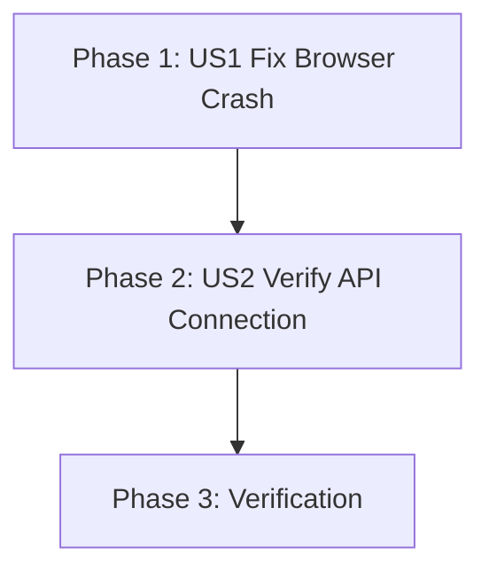

# Implementation Tasks: Fix Frontend Environment Variable Crash

**Feature**: 002-fix-frontend-env-crash
**Branch**: `002-fix-frontend-env-crash`
**Date**: 2025-12-14

## Overview

Fix critical browser crash caused by unsafe `process.env` access in ChatWidget component. Replace with typeof check pattern to prevent `ReferenceError: process is not defined` in browser runtime.

**Total Tasks**: 4
**Parallelizable**: 0
**Estimated Implementation Time**: 10 minutes

## Task Dependencies



### User Story Completion Order

1. **US1** (P1): Fix Browser Crash - MUST complete first (enables all other functionality)
2. **US2** (P2): Verify API Connection - Can complete after US1 fix applied
3. **Verification**: Final testing after code change deployed

### Parallel Execution Opportunities

**None** - Single file edit, must be done sequentially. All tasks depend on previous completion.

## Implementation Strategy

**MVP Scope**: US1 (Fix Browser Crash)
- Delivers: Chat widget loads without crashing, users can access chat functionality
- Validates: typeof check pattern works in browser environment

**Incremental Delivery**:
1. Phase 1 (US1): Apply typeof check fix → Verify no console errors
2. Phase 2 (US2): Verify API connection → Confirm correct URL in Network tab
3. Phase 3: Server restart and full testing

---

## Phase 1: User Story 1 (P1) - Browser Loads Chat Widget Without Crash

**Story Goal**: Users visiting the Docusaurus site can see and interact with the chat widget without encountering JavaScript runtime errors or white screen crashes.

**Acceptance Criteria**:
- Browser console shows NO "ReferenceError: process is not defined" errors
- Page loads completely without white screen
- Chat button appears in bottom-right corner

**Independent Test**:
1. Open http://localhost:3000 in browser
2. Open DevTools console (F12)
3. Verify NO "process is not defined" errors
4. Verify page renders fully with chat button visible

### Tasks

- [ ] T001 [US1] Replace unsafe process.env access with typeof check in src/components/ChatWidget/index.js
  - **File**: src/components/ChatWidget/index.js (line 5)
  - **Current Code**:
    ```javascript
    const API_BASE_URL = process.env.REACT_APP_API_URL || 'http://localhost:8000';
    ```
  - **Replace With**:
    ```javascript
    // Safe environment variable access (FR-001, FR-002)
    // Prevents ReferenceError when process is undefined in browser
    const API_BASE_URL = (typeof process !== 'undefined' && process && process.env && process.env.REACT_APP_API_URL)
      ? process.env.REACT_APP_API_URL
      : 'http://localhost:8000'; // FR-003: Fallback for local development
    ```
  - **Acceptance**:
    - Line 5 no longer has direct `process.env` access
    - typeof check is present before accessing process
    - Fallback to localhost:8000 remains
    - Comments explain FR-001, FR-002, FR-003 compliance

---

## Phase 2: User Story 2 (P2) - Chat Widget Connects to Correct API

**Story Goal**: The chat widget automatically connects to the correct backend API URL based on the deployment environment without manual code changes.

**Acceptance Criteria**:
- fetch requests go to http://localhost:8000/api/chat (not undefined)
- Network tab shows correct API URL
- No "undefined" in request URLs

**Independent Test**:
1. Open http://localhost:3000
2. Press F12 → Network tab
3. Click chat button, send test message
4. Verify fetch goes to http://localhost:8000/api/chat

### Tasks

- [ ] T002 [US2] Verify API URL constant is correctly resolved in browser runtime
  - **File**: src/components/ChatWidget/index.js
  - **Action**: After typeof check applied, confirm API_BASE_URL constant has correct value
  - **Method**:
    1. Add temporary console.log: `console.log('API_BASE_URL:', API_BASE_URL);`
    2. Start frontend
    3. Open browser console (F12)
    4. Verify output: `API_BASE_URL: http://localhost:8000`
    5. Remove console.log after verification
  - **Acceptance**:
    - Console shows API_BASE_URL has correct value (not undefined)
    - Value is 'http://localhost:8000' (localhost default)
    - No errors during constant resolution

---

## Phase 3: Verification & Server Restart

**Goal**: Verify fix works end-to-end with fresh server instances

### Tasks

- [ ] T003 Kill all Python and Node.js processes to clear old state
  - **Action**: Kill all backend and frontend processes
  - **Commands**:
    ```bash
    taskkill /F /IM python.exe 2>&1
    taskkill /F /IM node.exe 2>&1
    ```
  - **Acceptance**: All processes terminated (ignore "not found" errors if no processes running)

- [ ] T004 Restart backend and frontend servers with new code
  - **Backend Start**:
    ```bash
    cd backend
    python -m uvicorn main:app --host 0.0.0.0 --port 8000 --reload
    ```
  - **Wait**: 5 seconds for backend to initialize
  - **Frontend Start**:
    ```bash
    node node_modules/@docusaurus/core/bin/docusaurus.mjs start
    ```
  - **Verification**:
    1. Backend logs show: `✅ Allowed CORS origins: ['http://localhost:3000', 'http://127.0.0.1:3000']`
    2. Frontend logs show: `[SUCCESS] Docusaurus website is running at http://localhost:3000/`
    3. Open http://localhost:3000 in browser
    4. Open DevTools console (F12)
    5. Verify NO "ReferenceError: process is not defined" errors
    6. Verify chat button appears in bottom-right corner
    7. Click chat button to open widget
    8. Send test message
    9. Network tab shows fetch to http://localhost:8000/api/chat (not undefined)
  - **Acceptance**:
    - Both servers running without errors
    - Browser console clean (no ReferenceError)
    - Chat widget visible and functional
    - API requests use correct URL

---

## Task Summary

### By User Story

- **US1** (P1 - Fix Browser Crash): 1 task (T001)
- **US2** (P2 - Verify API Connection): 1 task (T002)
- **Verification & Restart**: 2 tasks (T003, T004)

### By Phase

- Phase 1 (US1): 1 task
- Phase 2 (US2): 1 task
- Phase 3 (Verification): 2 tasks

### Parallel Execution Strategy

**All Sequential** - Tasks must run in order:
1. T001: Apply fix
2. T002: Verify constant resolution
3. T003: Kill processes
4. T004: Restart and verify

**No parallel opportunities** - Single file modification with sequential verification steps.

---

## Implementation Notes

### Critical Requirements

1. **typeof Check Pattern** (FR-001, FR-002):
   - MUST use `typeof process !== 'undefined'` before accessing process
   - MUST chain property checks: `process && process.env && process.env.REACT_APP_API_URL`
   - Pattern prevents ReferenceError in browser environments

2. **Fallback Value** (FR-003):
   - MUST provide fallback: `'http://localhost:8000'`
   - Ensures constant always has valid URL
   - Maintains local development experience

3. **Preserve Comments** (FR-005):
   - Add comments explaining FR compliance
   - Document why typeof check is needed
   - Helps future developers understand browser safety requirement

### Testing Strategy

**After T001** (Code Fix):
- No testing yet - just apply the fix

**After T002** (Constant Verification):
- Add temporary console.log
- Verify constant has correct value
- Remove console.log

**After T003** (Process Kill):
- Verify all processes terminated

**After T004** (Server Restart):
- **Full Verification Checklist**:
  - [ ] Backend started successfully
  - [ ] Frontend started successfully
  - [ ] Browser loads http://localhost:3000
  - [ ] NO "process is not defined" errors in console
  - [ ] Chat button visible
  - [ ] Chat window opens on click
  - [ ] Network tab shows fetch to localhost:8000/api/chat
  - [ ] No "undefined" in API URL

**Final Acceptance**:
- All checklist items pass ✅
- Chat widget functional without crashes ✅
- typeof check prevents browser errors ✅

---

## References

- **Spec**: specs/002-fix-frontend-env-crash/spec.md
- **Plan**: specs/002-fix-frontend-env-crash/plan.md
- **Research**: specs/002-fix-frontend-env-crash/research.md
- **Quickstart**: specs/002-fix-frontend-env-crash/quickstart.md
- **Modified File**: src/components/ChatWidget/index.js (line 5)
- **Parent Feature**: 001-cors-env-config
