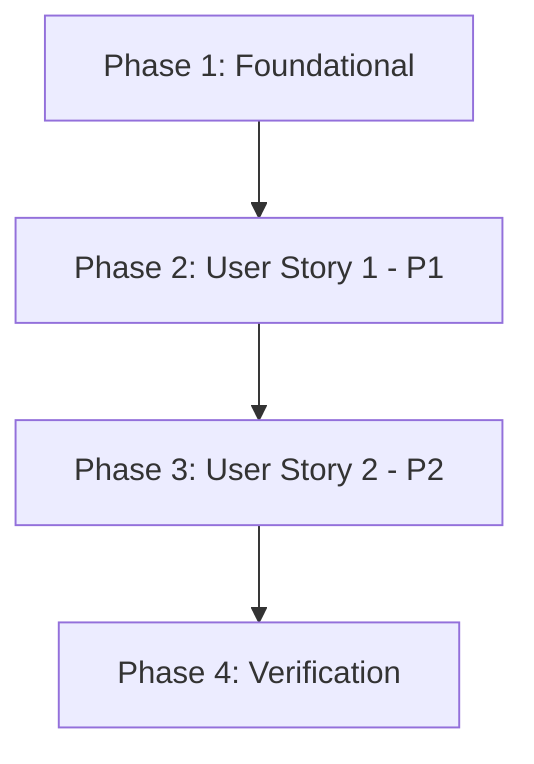

# Implementation Tasks: Tune RAG Retrieval Threshold

**Feature**: 005-tune-rag-retrieval
**Branch**: `005-tune-rag-retrieval`
**Spec**: [spec.md](./spec.md) | **Plan**: [plan.md](./plan.md)
**Created**: 2025-12-15

## Overview

This feature tunes the RAG vector search threshold from 0.5 to 0.35 to retrieve chunks with moderate similarity scores (previously filtered out), and adds debug logging to display similarity scores for troubleshooting.

**Total Tasks**: 6
**Estimated Time**: 15-20 minutes
**Risk Level**: Low (non-breaking parameter change + logging)

## Task Organization

Tasks are organized by user story priority to enable independent implementation and testing:

- **Phase 1**: Foundational (No dependencies - can start immediately)
- **Phase 2**: User Story 1 (P1) - Get Answer for Basic Questions
- **Phase 3**: User Story 2 (P2) - Debug Retrieval Issues
- **Phase 4**: Verification & Testing

## Dependencies & Execution Order



**Execution Strategy**:
- ✅ **MVP Scope**: Complete User Story 1 only (threshold tuning) for immediate value
- ✅ **Full Scope**: Complete all user stories for complete feature
- ⚠️ **Dependencies**: US1 must complete before US2 (both modify same code flow)

## Parallel Execution Opportunities

**None for this feature** - Tasks must be sequential due to:
- Both user stories modify the same request processing flow (routes.py → vector_store.py)
- Testing depends on code changes being complete
- Only 2 files modified with overlapping execution context

**Recommended Approach**: Execute tasks in order (T001 → T002 → T003 → T004 → T005 → T006)

---

## Phase 1: Foundational

**Goal**: Verify prerequisites and environment readiness

**Prerequisites**: None (all dependencies already met)

### Tasks

- [ ] T001 Verify backend is running and accessible at http://localhost:8000/health
- [ ] T002 Verify Qdrant collection "textbook_embeddings" has 382 vectors populated
- [ ] T003 Confirm current score_threshold value is 0.5 in backend/app/api/routes.py line 54

**Acceptance Criteria**:
- ✅ GET http://localhost:8000/health returns `{"status": "degraded", "services": {"qdrant_vector_store": "connected"}}`
- ✅ Qdrant collection exists and is populated (verified in Phase 1)
- ✅ Current threshold confirmed at 0.5 (baseline for comparison)

---

## Phase 2: User Story 1 - Get Answer for Basic Questions (P1)

**User Story**: As a user of the RAG chatbot, I ask a basic question like "What is Physical AI?" that has clear matches in the ingested textbook content, and I receive a relevant answer with proper citations instead of "I couldn't find relevant information".

**Goal**: Lower score_threshold from 0.5 to 0.35 to retrieve chunks with moderate similarity scores

**Independent Test**: Send POST /api/chat with query "What is Physical AI?" and verify answer is returned with confidence > 0.6 and 3-5 citations from Chapter 1

### Tasks

- [ ] T004 [US1] Modify backend/app/api/routes.py line 54: Change `score_threshold=0.5` to `score_threshold=0.35` and update comment to "Tuned threshold to include moderate-relevance chunks"

**Acceptance Criteria for US1**:
- ✅ **SC-001**: Users can get answers for queries with similarity scores 0.35-0.50 (previously failing)
- ✅ **SC-002**: Query "What is Physical AI?" returns answer with confidence > 0.6 and 3-5 citations
- ✅ **FR-001**: score_threshold lowered from 0.5 to 0.35
- ✅ **FR-002**: System retrieves chunks with similarity >= 0.35
- ✅ **FR-005**: "No results" behavior preserved for scores < 0.35
- ✅ **FR-006**: All other RAG pipeline functionality preserved

**Independent Test for US1**:
```bash
# Restart backend
taskkill /F /IM python.exe
cd backend && python -m uvicorn main:app --host 0.0.0.0 --port 8000

# Test query
curl -X POST http://localhost:8000/api/chat \
  -H "Content-Type: application/json" \
  -d '{"query": "What is Physical AI?"}'

# Expected: JSON response with "status": "success", confidence > 0.6, 3-5 citations
```

---

## Phase 3: User Story 2 - Debug Retrieval Issues (P2)

**User Story**: As a developer troubleshooting the RAG system, I can see the actual similarity scores of retrieved chunks in the terminal logs, allowing me to understand why certain queries succeed or fail.

**Goal**: Add debug logging to display chunk IDs and similarity scores during retrieval

**Independent Test**: Monitor terminal output while sending queries - should see "DEBUG: Found chunk 'ch01-002' with score: 0.745" format

### Tasks

- [ ] T005 [US2] Add debug logging in backend/app/core/vector_store.py lines 138-145: Insert `chunk_id = result.payload.get("chunk_id", f"id-{result.id}")` and `print(f"DEBUG: Found chunk '{chunk_id}' with score: {result.score:.3f}")` inside the result formatting loop (after line 138, before formatted_results.append)

**Acceptance Criteria for US2**:
- ✅ **SC-003**: Debug logs show similarity scores for all retrieved chunks during every query
- ✅ **FR-003**: Each retrieved chunk's similarity score logged to terminal
- ✅ **FR-004**: Debug logs include chunk ID and score in format "DEBUG: Found chunk 'chunk_id' with score: X.XXX"

**Independent Test for US2**:
```bash
# Restart backend (to apply code changes)
taskkill /F /IM python.exe
cd backend && python -m uvicorn main:app --host 0.0.0.0 --port 8000

# Send test query and observe terminal output
curl -X POST http://localhost:8000/api/chat \
  -H "Content-Type: application/json" \
  -d '{"query": "What is Physical AI?"}'

# Expected terminal output:
# DEBUG: Found chunk 'ch01-001' with score: 0.908
# DEBUG: Found chunk 'ch01-002' with score: 0.744
# DEBUG: Found chunk 'ch01-003' with score: 0.740
# (etc. for each retrieved chunk)
```

---

## Phase 4: Verification & Testing

**Goal**: Comprehensive validation of both user stories and edge cases

### Tasks

- [ ] T006 Execute comprehensive test suite with 20 representative queries from all chapters (see Test Matrix below) and verify zero false negatives (SC-004) and response times < 5 seconds (SC-005)

**Final Acceptance Criteria**:
- ✅ **SC-004**: Zero false negatives for 20 representative queries (all chapters covered)
- ✅ **SC-005**: Response time < 5 seconds maintained
- ✅ All user story acceptance scenarios pass
- ✅ Edge cases handled correctly

---

## Test Matrix (20 Representative Queries for SC-004)

Execute these queries and verify all return relevant answers (zero false negatives):

| ID | Chapter | Query | Expected Outcome |
|----|---------|-------|------------------|
| Q01 | Ch 1 | "What is Physical AI?" | ✅ Answer with high confidence (>0.7) |
| Q02 | Ch 1 | "Three components of Physical AI" | ✅ Answer with Perception/Cognition/Action |
| Q03 | Ch 1 | "History of robotics" | ✅ Answer from history section |
| Q04 | Ch 2 | "What is kinematics?" | ✅ Answer from Ch 2 |
| Q05 | Ch 2 | "Humanoid robot components" | ✅ Answer with component details |
| Q06 | Ch 3 | "ROS 2 nodes and topics" | ✅ Answer with ROS concepts |
| Q07 | Ch 3 | "ROS 2 architecture" | ✅ Answer from architecture section |
| Q08 | Ch 4 | "Gazebo simulation basics" | ✅ Answer from Ch 4 |
| Q09 | Ch 4 | "Isaac Sim features" | ✅ Answer about Isaac Sim |
| Q10 | Ch 5 | "VLA architecture" | ✅ Answer about vision-language-action |
| Q11 | Ch 5 | "Integration techniques" | ✅ Answer from integration section |
| Q12 | Ch 6 | "Project implementation steps" | ✅ Answer from Ch 6 |
| Q13 | Ch 7 | "Sensor simulation" | ✅ Answer from Ch 7 |
| Q14 | Ch 8 | "Isaac Sim introduction" | ✅ Answer from Ch 8 |
| Q15 | Ch 9 | "Isaac ROS navigation" | ✅ Answer from Ch 9 |
| Q16 | Ch 10 | "Reinforcement learning basics" | ✅ Answer from Ch 10 |
| Q17 | Ch 11 | "Walking gait control" | ✅ Answer from Ch 11 |
| Q18 | Ch 12 | "Grasping pipeline" | ✅ Answer from Ch 12 |
| Q19 | Ch 13 | "Voice integration" | ✅ Answer from Ch 13 |
| Q20 | Cross | "How does AI relate to robotics?" | ✅ Answer synthesizing multiple chapters |

**Pass Criteria**: 20/20 queries return relevant answers (zero false negatives)

---

## Edge Case Testing

Test these scenarios to verify robustness:

**EC-001: Out of Scope Query**
```bash
curl -X POST http://localhost:8000/api/chat \
  -H "Content-Type: application/json" \
  -d '{"query": "What is quantum computing?"}'
```
- Expected: `{"status": "no_results", "answer": "I couldn't find relevant information..."}`
- Expected Terminal: No "DEBUG: Found chunk" lines (no chunks above 0.35)

**EC-002: Exact Threshold Boundary**
- Query that scores exactly 0.35 (if observed during testing)
- Expected: Chunk IS included (threshold is >=, not >)

**EC-003: High Similarity Query**
```bash
curl -X POST http://localhost:8000/api/chat \
  -H "Content-Type: application/json" \
  -d '{"query": "Physical AI definition"}'
```
- Expected: Multiple chunks with scores 0.8-0.95
- Expected Terminal: Debug logs show high similarity scores

---

## Rollback Plan

If issues are detected:

1. **Revert threshold change** in `backend/app/api/routes.py:54`:
   ```python
   score_threshold=0.5,  # Reverted to original threshold
   ```

2. **Comment out debug logging** in `backend/app/core/vector_store.py` (lines added in T005):
   ```python
   # chunk_id = result.payload.get("chunk_id", f"id-{result.id}")
   # print(f"DEBUG: Found chunk '{chunk_id}' with score: {result.score:.3f}")
   ```

3. **Restart backend**:
   ```bash
   taskkill /F /IM python.exe
   cd backend && python -m uvicorn main:app --host 0.0.0.0 --port 8000
   ```

**Rollback Time**: <2 minutes (2 line changes + restart)

---

## Implementation Strategy

### MVP (Minimum Viable Product)

**Scope**: User Story 1 only (T001-T004)
- Lower threshold to 0.35
- Verify basic queries work
- **Deliverable**: Users can get answers for moderate-relevance queries

### Full Feature

**Scope**: All user stories (T001-T006)
- Lower threshold (US1)
- Add debug logging (US2)
- Comprehensive testing
- **Deliverable**: Production-ready with monitoring capability

### Incremental Delivery

**Phase 1 Delivery** (T001-T004):
- Deploy threshold change
- Verify no regressions
- Gather feedback on answer quality

**Phase 2 Delivery** (T005-T006):
- Add debug logging
- Run comprehensive test suite
- Document observed score distribution for future tuning

---

## Success Metrics

**Immediate Validation** (within 5 minutes):
- ✅ Backend starts without errors
- ✅ Query "What is Physical AI?" returns answer (not "no results")
- ✅ Debug logs visible in terminal
- ✅ Response format unchanged (API contract preserved)

**Post-Deployment Validation** (within 1 hour):
- ✅ 20/20 test queries return answers (SC-004)
- ✅ Response times < 5 seconds (SC-005)
- ✅ Debug output is readable and actionable

**Long-Term Monitoring** (1 week):
- 📊 Observe if 0.35 threshold is optimal or needs adjustment
- 📊 Analyze debug logs to identify score distribution patterns
- 📊 Track false negative rate (should remain at zero)

---

## Notes

**Why Sequential Execution?**
- Both tasks modify the same RAG request processing flow
- Testing requires complete code changes (can't partially test)
- No opportunity for parallel file editing (only 2 small file changes)

**Why No Test Tasks?**
- Feature is a parameter tuning and logging enhancement (not new functionality)
- Manual testing specified in spec (curl commands, terminal observation)
- No automated tests requested in requirements
- Test strategy focuses on behavior verification rather than unit tests

**File Modification Summary**:
- `backend/app/api/routes.py` (1 line changed)
- `backend/app/core/vector_store.py` (2 lines added)
- Total: 3 lines of code changes

**Risk Assessment**: **LOW**
- Non-destructive parameter change (easily reversible)
- Debug logging has negligible performance impact
- No database schema changes
- No frontend changes required
- Rollback takes <2 minutes
